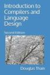

# CSE 40243 - Compilers and Language Design - Fall 2025

MWF 9:25-10:15 in Cushing 303

## Instructors

<table markdown="0">
<tr>
<td></td>
<td> 
Prof. Douglas Thain (<tt>dthain@nd.edu</tt>) 
Office Hours: MW 2-4PM  
Office: 384 Fitpatrick Hall
</td>
</tr>
<tr>
<td></td>
<td>
TA: Prince Noah Johnson (<tt>pjohns24@nd.edu</tt>) 
Office Hours: Tue 4-6PM, Thu 5-7PM 
Office: CSE Student Commons
</td>
</tr>
</table>

## Online Textbook

<table markdown="0">
<tr>
<td></td>
<td>
Douglas Thain, 
Introduction to Compilers and Language Design, 
2nd edition, 2021. 
<a href="http://compilerbook.org">http://compilerbook.org</a>
</td>
</tr>
</table>

## Important Documents

- [Course Syllabus](syllabus)
- [Slack Channel](https://nd-cse.slack.com/channels/compilers-fa25)
- [Online Textbook](http://compilerbook.org)
- [Canvas Course Page](https://canvas.nd.edu/courses/124956)
- [Starter Code](https://github.com/dthain/compilerbook-starter-code)
- [General Assignment Instructions](general)
- [B-Minor 2025 Language Overview](bminor)

## Course Schedule

<table markdown="0">

<tr>
<th>
Week
<th>
Readings
<th>
Monday
<th>
Wednesday
<th>
Friday
<th>
Due Friday
<th>
Reference

<tr>
<td>
Aug 25
<td>
<li><a href="syllabus">Syllabus</a>
<li><a href="https://dthain.github.io/books/compiler/chapter1.pdf">Chapter 1</a>
<li><a href="https://dthain.github.io/books/compiler/chapter2.pdf">Chapter 2</a>
<li><a href="https://www.joelonsoftware.com/2003/10/08/the-absolute-minimum-every-software-developer-absolutely-positively-must-know-about-unicode-and-character-sets-no-excuses/">The&nbsp;Absolute&nbsp;Minimum...</a>
<td>
<a href="https://docs.google.com/presentation/d/1rjtXRK-gbc9ZA4RW97zVnwUZLxlr_mDndqCMHPiy-mo/edit">Overview</a>
<td>
Compiler Stages
<td>
Tokens and FAs
<td>
<strong><a href="homework1">Homework&nbsp;1</a></strong>
<td>
<a href="handouts/handout-regex">Regex Handout</a> 
<a href="https://regex101.com/">Regex 101</a>

<tr>
<td>
Sep 1
<td>
<li><a href="https://dthain.github.io/books/compiler/chapter3.pdf">Chapter 3</a> 
<li><a href="bminor">B-Minor&nbsp;2025</a> 
<li><a href="https://nee.lv/2021/02/28/How-I-cut-GTA-Online-loading-times-by-70/">GTA&nbsp;Loading&nbsp;Time</a>
<td>
Regular Expressions
<td>
RE->NFA
<td>
NFA->DFA
<td>
<strong><a href="encoder">Encoder Due</a></strong>
<td>
<a href="handouts/handout-re-nfa-dfa">RE-NFA-DFA&nbsp;Handout</a> 
<a href="https://github.com/cooperative-computing-lab/cctools/blob/master/dttools/src/jx_parse.c#L287">Hand&nbsp;Scanner</a> 

<tr>
<td>
Sep 8
<td>
<li><a href="https://dthain.github.io/books/compiler/chapter4.pdf">Chapter 4.1-4.2</a> 
<li><a href="https://martinsteffen.github.io/compilerconstruction/leftandtailrecusion/">RegExp&nbsp;and&nbsp;Grammars</a> 
<td>
Flex
<td>
CFGs
<td>
CFGs
<td>
<strong><a href="homework2">Homework 2</a></strong>
<td>
<a href="https://westes.github.io/flex/manual/">Flex&nbsp;Scanner&nbsp;Generator</a> 
<a href="https://web.stanford.edu/class/archive/cs/cs103/cs103.1156/tools/cfg/">CFG&nbsp;Tool</a> 

<tr>
<td>
Sep 15
<td>
<li><a href="https://dthain.github.io/books/compiler/chapter4.pdf">Chapter 4.2-4.3</a> 
<li><a href="https://pgrandinetti.github.io/compilers/page/how-to-design-a-parser/">How&nbsp;to&nbsp;design&nbsp;a&nbsp;Parser?</a>  
<td>
LL(1) Grammars
<td>
Recursive Descent
<td>
LL(1) Table Parsing
<td>
<strong><a href="scanner">Scanner Due</a></strong>
<td>
<a href="handouts/handout-ll1">LL(1) Handout</a>
<a href="https://en.wikipedia.org/wiki/Comparison_of_parser_generators">Parser&nbsp;Generators</a> 

<tr>
<td>
Sep 22
<td>
<a href="https://dthain.github.io/books/compiler/chapter4.pdf">Chapter 4.4-4.6</a>
<td>
Shift-Reduce Parsing
<td>
LR(0) Automaton
<td>
SLR Parsing
<td>
<strong><A href="homework3">Homework 3</a></strong>
<td>
<a href="handouts/handout-slr.html">SLR Handout</a>
<tr>
<td>
Sep 29
<td>
<li><a href="https://dthain.github.io/books/compiler/chapter5.pdf">Chapter 5</a> 
<li><a href="https://blog.reverberate.org/2013/09/ll-and-lr-in-context-why-parsing-tools.html">Why&nbsp;Parsing&nbsp;Tools&nbsp;Are&nbsp;Hard&nbsp;</a> 
<td>
LR(1) Parsing
<td>
Bison
<td>
Parsing B-Minor
<td>
<strong><a href="homework4">Homework 4</a></strong>
<td>
<a href="https://www.gnu.org/software/bison/manual/html_node/index.html">Bison&nbsp;Manual</a>
 
<a href="https://github.com/dthain/compilerbook-examples/tree/master/chapter5">Bison&nbsp;Examples</a>

<tr>
<td>
Oct 6
<td>
<a href="https://dthain.github.io/books/compiler/chapter5.pdf">Chapter 5</a>
<td>
Parsing B-Minor
<td>
AST
<td>
AST
<td>
<strong><a href="parser">Parser Due</a></strong>
<td>
<a href="ast.html">AST Handout</a>

<tr>
<td>
Oct 13
<td>
<a href="https://dthain.github.io/books/compiler/chapter6.pdf">Chapter 6</a>
<td>
Printing
<td>
Printing
<td>
<strong><a href="midterm">Midterm&nbsp;Exam</a></strong>
<td>
<td>

<tr>
<td>
Oct 20
<td>
<td><i>Fall&nbsp;Break</i>
<td><i>Fall&nbsp;Break</i>
<td><i>Fall&nbsp;Break</i>
<td>
<td>

<tr>
<td>
Oct 27
<td>
<a href="https://dthain.github.io/books/compiler/chapter7.pdf">Chapter 7</a>
<td>
Type Systems
<td>
Type Systems
<td>
Name Resolution
<td>
<strong><a href=printer>Printer Due</a></strong>
<td>

<tr>
<td>
Nov 3
<td>
<a href="https://dthain.github.io/books/compiler/chapter7.pdf">Chapter 7</a>
<td>Checking Exprs
<td>Checking Statements
<td>Checking Decls
<<<<<<< HEAD
<td>
<td>

<tr>
<td>
Nov 10
<td>
<a href="https://dthain.github.io/books/compiler/chapter9.pdf">Chapter 9</a>
<td>Memory&nbsp;Org
<td>Memory&nbsp;Org
<td>Memory&nbsp;Org
<td><strong><a href=resolve>Resolver Due</a></strong>
<td>

<tr>
<td>
Nov 17
<td>
<a href="https://dthain.github.io/books/compiler/chapter10.pdf">Chapter 10</a>
<td>Assembly
<td>Assembly
<td>Assembly
<td><strong><a href=typecheck>Type Checker Due</a></strong>
<td><a href="https://www.intel.com/content/www/us/en/developer/articles/technical/intel-sdm.html">Intel&nbsp;Manuals</a>
 
<a href="https://refspecs.linuxbase.org/elf/x86_64-abi-0.99.pdf">Calling&nbsp;Convention</a>

<tr>
<td>
Nov 24
<td>
<a href="https://dthain.github.io/books/compiler/chapter11.pdf">Chapter 11</a>
<td>Codegen Exprs
<td><i>Thanksgiving</i>
<td><i>Thanksgiving</i>
<td>
<td>

<tr>
<td>
Dec 1
<td>
<a href="https://dthain.github.io/books/compiler/chapter12.pdf">Chapter 12</a>
<td>Codegen Stmts
<td>Codegen Decls
<td>Optimization
<td>
<td>

<tr>
<td>
Dec 8
<td>
<a href="https://dthain.github.io/books/compiler/chapter12.pdf">Chapter 12</a>
<td> Optimization
<td> Review <strong>Codegen Due</strong>
<td> <strong>Final Exam</strong> <strong>7:30-9:30PM</strong>
<td>
<td>

</table>
